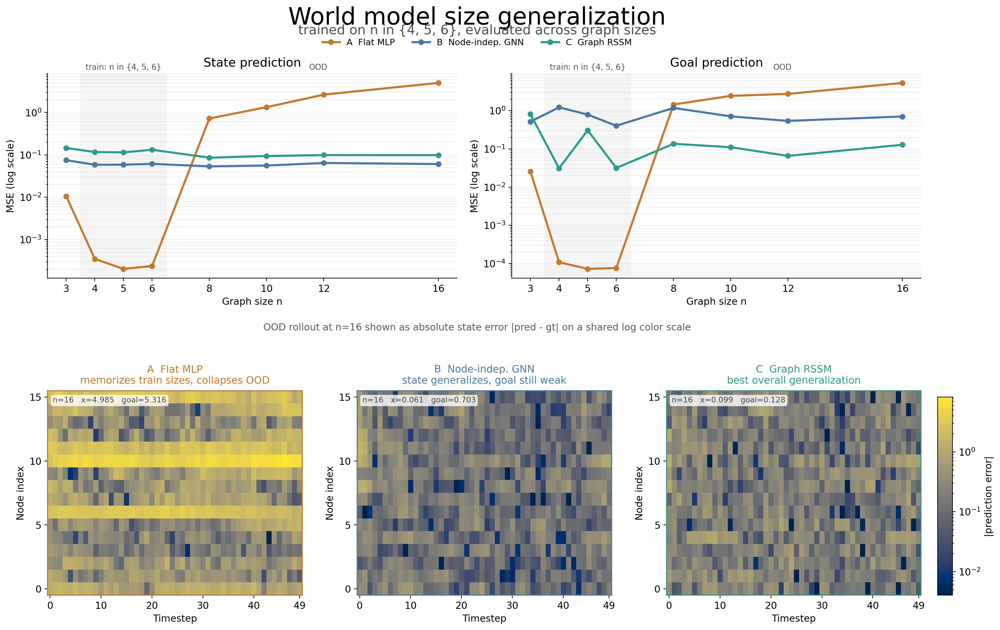

# g-dreamer — graph-structured world models

World models for physical systems whose dynamics are graph-structured, built on top of [DreamerV3](https://github.com/danijar/dreamerv3). The central question: when a system's physics involves local coupling between nodes (each node's state depends on its neighbors), does that structure need to live *inside* the world model's transition function — or is it enough to use graph encoders only at the observation boundary?

> **Status: active development.** One-step prediction generalization experiment complete. Online variants next.

---

## Key result

Three world model variants were trained on a ring-topology consensus environment (n ∈ {4, 5, 6} nodes) and evaluated on unseen graph sizes (n ∈ {3, 8, 10, 12, 16}).



| Variant | Architecture | OOD state MSE (n=16) | OOD goal MSE (n=16) |
|---|---|---|---|
| A: Flat MLP | no graph structure anywhere | 4.99 — collapses | 5.32 — collapses |
| B: Node-indep. GNN | GNN encoder/decoder, per-node MLP dynamics (no cross-node coupling) | 0.061 — flat | 0.703 — broken everywhere |
| C: Graph RSSM | GNN encoder + message-passing dynamics | 0.099 — flat | 0.128 — degrades gracefully |

**Note 1 — encoder graph structure gives size invariance on state prediction.** Both B and C stay flat OOD on x_mse while A collapses by 50×. A GNN encoder alone is sufficient for this.

**Note 2 — cross-node coupling in dynamics matters beyond size generalization.** B's goal_mse is high at *every* size, including in-distribution. Per-node-independent dynamics cannot jointly model the physics and preserve static context features — the two objectives compete in the same latent without the distributed pathways that message passing provides. C's total in-distribution loss is 3× lower than B's.

---

## Environment

The current testbed is a **ring-topology consensus environment** (see `src/dgr/envs/suites/toy_graph_control/`). N nodes on a directed ring; each node has a scalar state x_i and a fixed goal goal_i. Dynamics:

```
x_next_i = x_i + α·(mean(x_neighbors) − x_i) + β·u_i + noise
```

The experiment above uses the simplest configuration: dense actuation (every node actuated), full goal visibility, iid goals. This isolates the topology question cleanly. The codebase also supports hidden goals, sparse actuation, and misaligned actuation/observability (see `scenarios.py`).

---

## World model variants

All three variants are in `src/dgr/models/world_models/`.

**Variant A — Flat MLP** (`flat_wm.py`)
Flattens padded node observations to a fixed vector. No awareness of graph structure. Serves as the baseline: memorises training topologies, fails OOD.

**Variant B — Node-independent GNN** (`graph_enc_dec_wm.py`)
GNN encoder produces per-node latents. Dynamics are a per-node MLP — each node transitions from its own latent and action only, with no cross-node communication. Decoder is per-node. Tests whether graph structure at the periphery is sufficient.

**Variant C — Graph RSSM** (`graph_rssm_wm.py`)
GNN encoder, message-passing dynamics, per-node decoder. Graph structure throughout. The full version.

---

## Install

Requires Python 3.11.

```bash
poetry install --with upstream
poetry install --with dev   # linting, testing
```

## Running the world model experiment

Collect data (800k transitions, already done — see `experiments/world_model/`):
```bash
poetry run python scripts/collect_consensus_world_model_data.py \
  --sizes 3,4,5,6,8,10,12,16 --episodes-per-size 2000 --seed 0 \
  --out experiments/world_model/consensus_transitions_large.npz
```

Train a variant:
```bash
poetry run python scripts/train_minimal_graph_world_model.py \
  --dataset experiments/world_model/consensus_transitions_large.npz \
  --model graph_rssm --epochs 60
```

Evaluate:
```bash
poetry run python scripts/eval_minimal_graph_world_model.py \
  --checkpoint experiments/world_model/graph_rssm/graph_rssm_world_model.pkl \
  --train-sizes 4,5,6 --eval-sizes 3,8,10,12,16 --episodes 5
```

Regenerate the figure:
```bash
poetry run python scripts/plot_size_generalization.py
```

Run tests:
```bash
pytest
```

---

## Project structure

```
src/dgr/
├── interface/graph_spec.py                        # GraphSpec / Graph types, masking contract
├── models/message_passing.py                      # Masked message-passing primitive
├── models/world_models/                           # World model variants A, B, C
│   ├── flat_wm.py
│   ├── graph_enc_dec_wm.py
│   └── graph_rssm_wm.py
├── envs/suites/toy_graph_control/                 # Ring consensus env (JAX/JIT)
│   ├── core.py
│   └── scenarios.py
└── train.py                                       # DreamerV3 training orchestrator

scripts/
├── collect_consensus_world_model_data.py
├── train_minimal_graph_world_model.py
├── eval_minimal_graph_world_model.py
└── plot_size_generalization.py

docs/
├── graph_obs_contract.md                          # Padded/masked graph observation spec
├── sprint_handoff.md                              # Implementation decisions and status
└── assets/size_generalization.png                 # Key result figure
```

See [docs/graph_obs_contract.md](docs/graph_obs_contract.md) for the graph data contract.

---

## Dev

```bash
pre-commit install
pre-commit run --all-files
```

## Citation

If you use this work, please cite it using [CITATION.cff](CITATION.cff).
