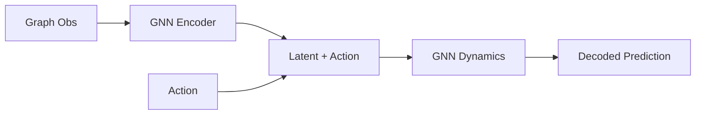

#  G - D R E A M E R   |   graph + dreamer

Graph-structured world models for reinforcement learning, extending [DreamerV3](https://github.com/danijar/dreamerv3) to problems that lend themselves to graph representations. Supports single- and multi-agent settings. the main experiment axes are: Topology (e.g., variable sizes, asymmetric weights ...) / Observability (e.g., full state + full goal, hidden goals, local-only sensing) / Actuation (sparse, unaligned vs aligned actuation or observability) / Dynamics (diffusion, advection, waves, switching, hybrid).

> **Status: early development.** Minimal world model training and a first generalization demo are in place; the broader graph-Dreamer stack is still being built out.

---

## Install

Requires Python 3.11.

```bash
poetry install --with upstream
```

For dev tools (linting, testing):

```bash
poetry install --with dev
```

## Quickstart

Run upstream DreamerV3 on Crafter (sanity check):

```bash
bash scripts/run_upstream_crafter_debug.sh
```

Run tests:

```bash
pytest
```

## Architecture

At a high level, the graph world model is intended to follow a message-passing Dreamer loop:



Current scaffolding for this path lives in `src/dgr/agents/graph_dreamerv3/encoders/gnn.py`, `src/dgr/agents/graph_dreamerv3/rssm_gnn.py`, and `src/dgr/agents/graph_dreamerv3/world_model.py`.

## Structure

```
src/dgr/
├── interface/graph_spec.py                      # GraphSpec / Graph contract, validation, permutation utils
├── models/message_passing.py                    # Masked message-passing primitive
├── envs/suites/toy_graph_control/consensus.py   # Ring-topology consensus env (JAX/JIT)
├── train.py                                     # Training orchestrator
└── configs/                                     # YAML configs (agent, env, runs)
```

See [docs/graph_obs_contract.md](docs/graph_obs_contract.md) for the padded/masked graph observation spec.

## Experiments

- `experiments/runs/`: train/eval with Dreamer (checkpoints)
- `experiments/toy_eval/`: controller baselines (no checkpoints)
- `experiments/toy_debug/`: single-episode proofs / development traces

## Dev

Pre-commit hooks (ruff lint + format):

```bash
pre-commit install
```

## Citation

If you use this work, please cite it using [CITATION.cff](CITATION.cff).
